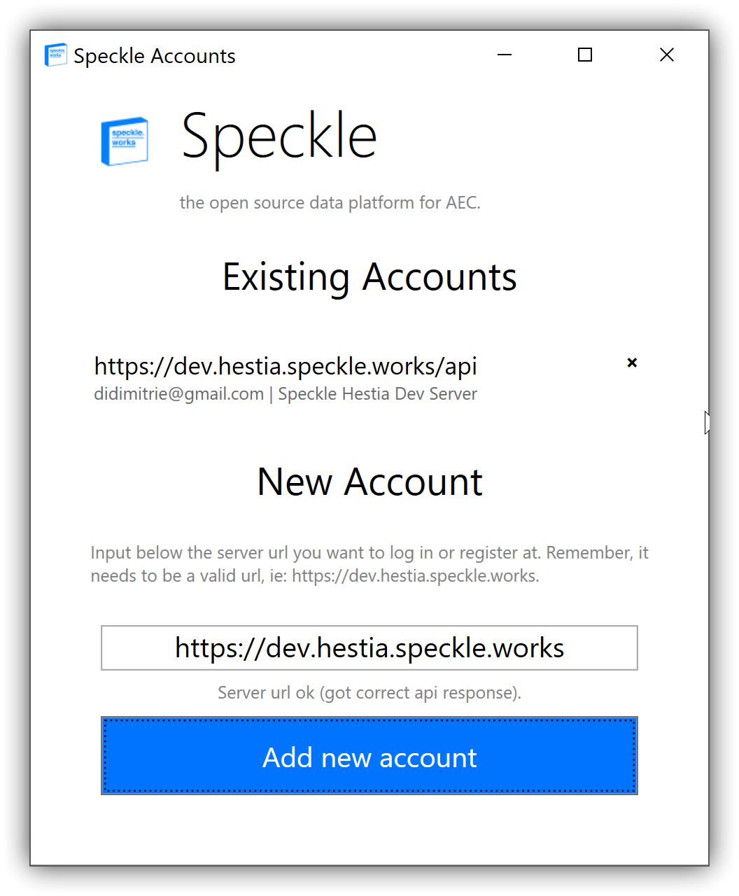
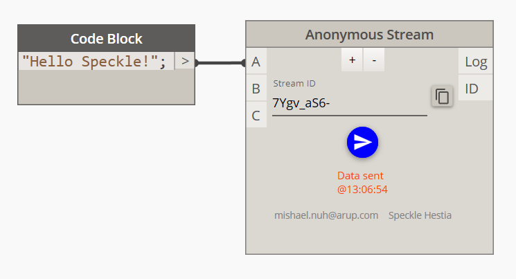
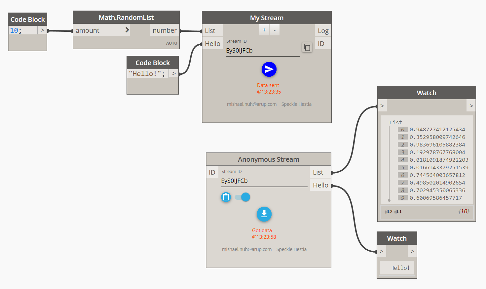
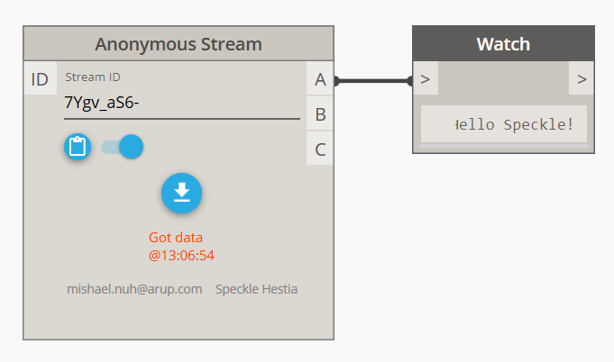
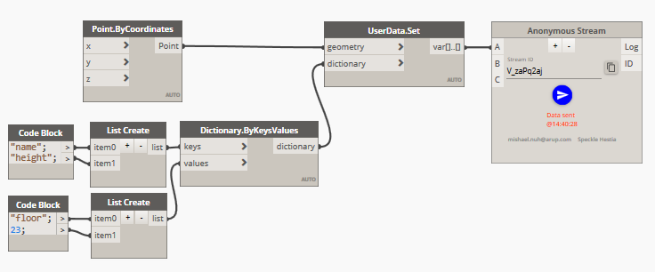
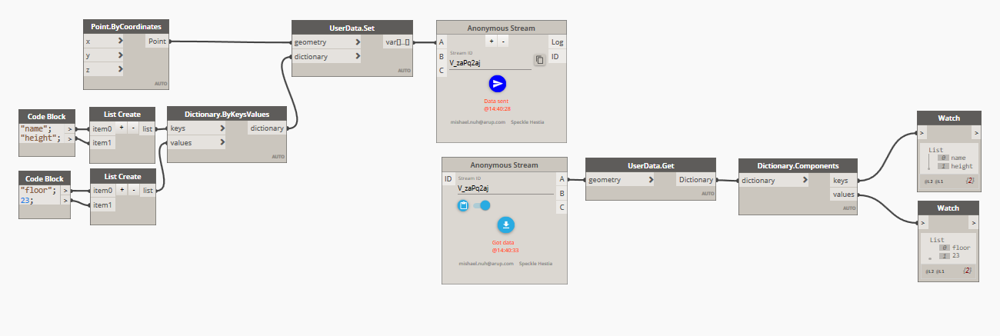

# Speckle for Dynamo

## Using the plugin

The Dynamo client is bundled as part of the [Speckle installation package](/plugins/#installing-the-speckle-plugins). Once installed, the nodes will appear under the Speckle tab of Dynamo.

There are two nodes in the Speckle Dynamo plugin which will allow you to send and receive data:
-  Speckle Sender
-  Speckle Receiver

In most cases, you will work mainly with these nodes.

## Sending a stream

To send data from the Dynamo client, place a *Speckle Sender* node on the graph. If you have not already logged in from another client, a login window will appear. From here, you can login to an account or register for a new one on the [Speckle server of your choice](/getting-started.html#arup-s-speckle-servers).



Once logged in, you will see the Speckle data sender on the graph initialised. To send data, attach any data you wish to send to the node. For example, let us attach a string to the node input. The text is now sent as part of the stream, ready for further use.



There are many features of the sender node which is useful for manipulating and organizing your data. The inputs of the sender are the layers of the stream; you can attach any data to an input and it will be sent within that layer of the stream. You can add or remove layers using the + and - buttons. Layers can be renamed by *right-clicking* on the node and selecting the *Rename Layers (Inputs)* option.




## Receiving a stream

The process for receiving a stream is similar to the process of sending a stream. First, place a *Speckle Receiver* node onto the graph. If you have not already logged in from another client, a login window will appear which will allow you to login or register as before.

Once you login and the receiver node is initialized, you can receive a stream by entering a stream's `streamID` into either the *ID* node input or the *Stream ID* text field.



## Changing accounts

The Dynamo client automatically uses your default Speckle account. To change this, select *Speckle* > *Manage Accounts* from the menu bar. From there, a login window will appear allowing you to modify the account being used, as well as the option to login to an account or register for a new one on the Speckle server of your choice.

## Custom Properties

Custom properties can be attached to most objects you send within Speckle. This allows for enriched data transfer alongside basic geometry and primitive data.

To do this, use the "UserData.Set" node included in the Speckle plugin. This node takes in the object you with to attach the user data to and the dictionary of user data. Once you attach the dictionary, the object can now be sent along as usual.

 

To unpack the data from the object, use the "UserData.Get" node included in the Speckle plugin. This will expose all the properties that were set and their values.

 

If you wish to access the data elsewhere (such as through the API), all of user data is accessible under the `properties` property of the SpeckleObject. An example of this is shown below:

```json
{
"type": "Point",
"value": [...],
"hash": "01cb82d81078a3cec1b138149e1d657f",
"properties": {
    "name": "floor",
    "height": 23
}
}
```
