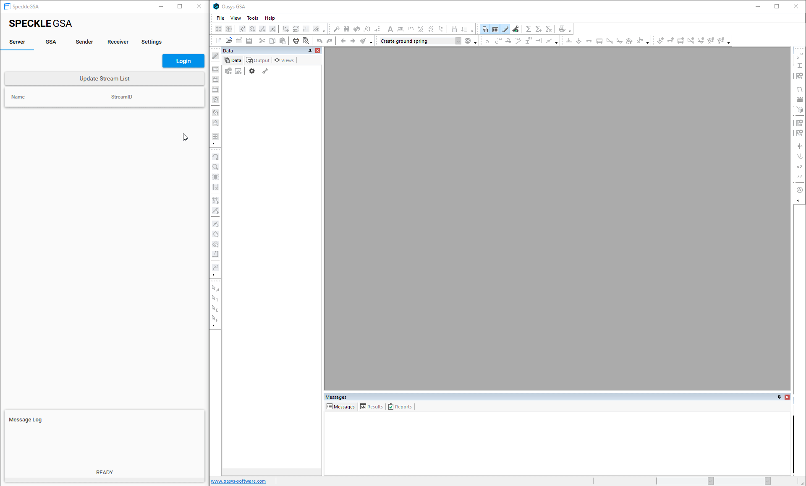

Receiving streams can be done through the receiver tab. As with sending, you will need to login and create/open a GSA file prior to receiving. To start sending, add the stream IDs of the streams you wish to receive using the `Add Receiver` button. Next, click on the <i class="fa fa-play-circle"></i> button to start receiving.

> You will need to pause the receiver by clicking the <i class="fa fa-pause-circle"></i> button before sending streams or changing any settings.

Within the receiver tab, there are two toggles to change how the sender operates.
- The `Layer to Stream` toggle allows you to write to either the `Design` or `Analysis` layer of GSA.
- The `Streaming Method` toggle changes whether the plugin will automatically receives any stream changes or whether it will only receive and write once. **It is recommended that you do not modify the model while in continuous mode as it may cause unintended effects.**

Once the receiver is paused (or if in single streaming mode), you will be presented with an option to bake the objects into GSA. **Baked objects will no longer be tracked; receiving the same stream within the same model will create duplicate entities.** Choosing not to bake the objects will cause the GSA client to delete any entities it wrote while receiving the stream. Pre-existing entities will not be deleted.