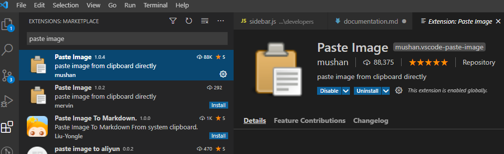
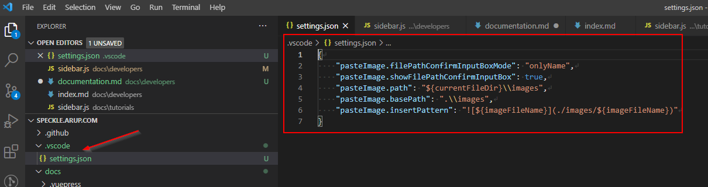
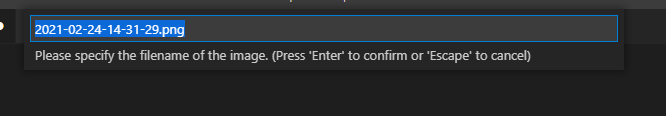
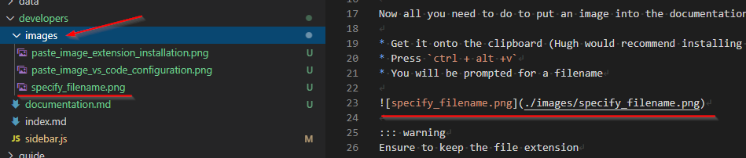

Guidance on how to contribute to this documentation site.

:::tip Credits
This site was derived from the [Speckle site](https://speckle.arup.com), created by Hugh Groves, David de Koning and Peter Grainger.  Credits to them for the initial configuration
:::

## Building the site locally

If you would like to contribute significant changes to this, first clone the repository to your desktop and run `npm install` in the root directory.

You can then run `npm run dev` to serve the site locally. Any changes you make to individual pages will be automatically compiled and updated. If you make a change to a sidebar or the navigation bar, you will have to stop (Ctrl-C) and restart the npm process.

To generate the html output, run the command `npm run build`. The static files are generated at `docs/.vuepress/dist`. You generally will only need to do this to confirm that there aren't any compile errors.

## Updating the site

When updating a new file, remember the following:

* H2 headers (`## Header title`) will be pulled into the table of content in the sidebar (H1 and H3 to H6 will not)
* you **must** have a blank link after your headers or they will be ignored
* put any images or other files into the `images/` folder next to the file your editing, and refer to them with ``

When adding a new file into one of the subfolders, 

* add an entry into the `sidebar.js` file in that folder (unless you don't want the page to show up in the sidebar).
* add a YAML header to the page with at least `title: Your page's title`. This title will appear in the sidebar.

Prior to pushing to the github repo:

* check that the site works properly by running `npm run dev` from the repo's root folder. The site will be served to [localhost:8080](http://localhost:8080/).
* check that the site builds without errors by running `npm run build`.

Once you have checked that the site builds without errors and that it looks right, go ahead and push to the github repo. For small changes, you can push directly to `main`, but you can also set up a branch and pull request if you'd like input from the rest of the team.

## Paste Image extension

First install the Paste Image extension from the VS Code extension tab

Hugh has already configured the extension to work correctly within the `speckle.arup.com` documentation site. No further configuration should be required.

Now all you need to do to put an image into the documentation is:

* Get the image you want to include onto the clipboard (Hugh would recommend installing [GreenShot](https://getgreenshot.org/) to make getting screengrabs easier)
* Press `ctrl + alt +v`
* You will be prompted for a filename

::: warning
Ensure to keep the file extension
:::

* The file will be put in the `images` folder at the same level as the current markdown file

::: warning
If the `images` folder does not currently exist you will need to create it
:::

* The correct markdown syntax will be entered into the document

* Done!